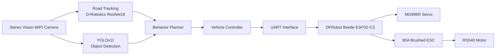
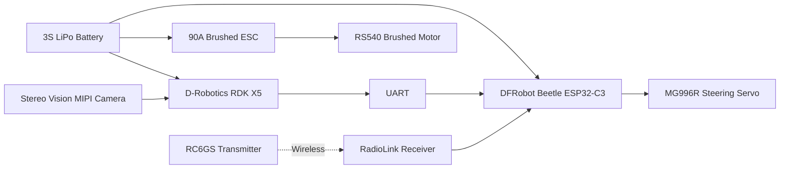
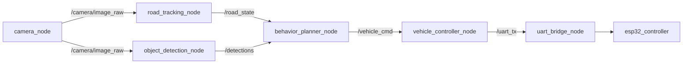
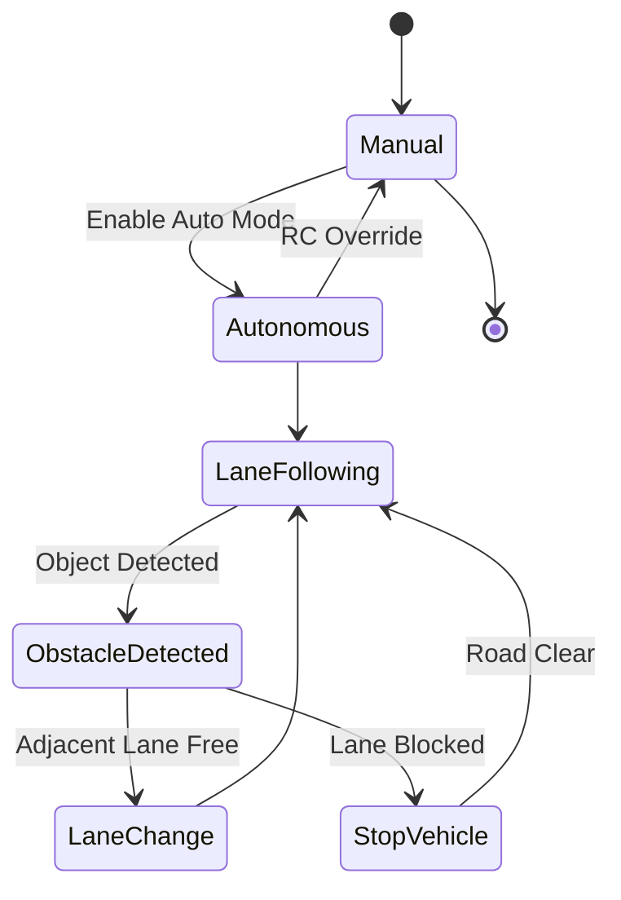
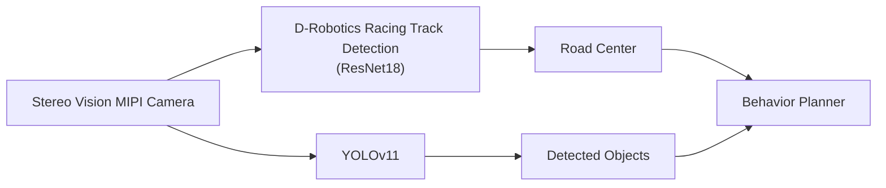

# RDK X5 Autonomous Vehicle
## Stage 2 Proposal – Robotics Dream Keeper Challenge 2026

**Author:** Vishal Sharma (Pro Know)  
**Repository:** https://github.com/proknowdiy/RDK-X5-Autonomous-Vehicle  
**Version:** 1.1

---

# 1. Project Overview

The **RDK X5 Autonomous Vehicle** is a 1/10 scale autonomous vehicle built around the **D-Robotics RDK X5**. The goal is to demonstrate a complete edge-AI autonomous driving pipeline using **ROS 2**, the **D-Robotics Racing Track Detection (ResNet18)** model, and **YOLOv11** for object detection.

Unlike a traditional line-following robot, the vehicle drives on a realistic two-lane miniature road, detects obstacles, performs lane changes, and supports instant manual override through a RadioLink RC system.

---

# 2. Challenge 1 – Concept & Application Design

## Operating Environment

| Item | Value |
|------|-------|
| Environment | Indoor |
| Road Width | 50 cm |
| Vehicle Scale | 1/10 |
| Lighting | 300–800 Lux |
| Camera | D-Robotics Stereo Vision MIPI Camera |
| Main Computer | D-Robotics RDK X5 |
| Vehicle MCU | DFRobot Beetle ESP32-C3 |

## Target Users

- Robotics developers
- AI researchers
- Embedded engineers
- Students
- Makers

## AI Capability

### Perception Layer

Two AI models execute concurrently on the RDK X5 BPU.

| AI Model | Purpose |
|----------|---------|
| **D-Robotics Racing Track Detection (ResNet18)** | Estimate road centerline and steering reference |
| **YOLOv11 (Planned)** | Detect vehicles and static obstacles |

### Behavior Planning

- Lane following
- Obstacle avoidance
- Lane change
- Speed selection

### Vehicle Control

- Steering
- Throttle
- Emergency stop
- Manual RC override

## Innovation

- Uses the official **D-Robotics Racing Track Detection (ResNet18)** model instead of OpenCV line following.
- Two AI models execute simultaneously on the RDK X5.
- ROS 2 modular architecture.
- Dedicated ESP32 vehicle controller.
- Expandable autonomous driving platform.

## Success Criteria

| ID | Goal |
|----|------|
| G1 | Camera ≥30 FPS |
| G2 | ResNet18 ≥20 FPS |
| G3 | YOLOv11 ≥15 FPS |
| G4 | Concurrent ResNet18 + YOLO inference |
| G5 | Complete one autonomous lap |
| G6 | Detect and avoid a static obstacle |
| G7 | Autonomous lane change |
| G8 | Manual RC override available at all times |

---

# 3. Challenge 2 – AI System Architecture

## System Flow



## Hardware Architecture



## ROS2 Node Graph



## Compute Allocation

| Module | AI Model | Execution |
|---------|----------|-----------|
| Camera Capture | — | CPU |
| Road Tracking | D-Robotics Racing Track Detection (ResNet18) | BPU |
| Object Detection | YOLOv11 | BPU |
| Behavior Planner | Rule Based | CPU |
| Vehicle Controller | ROS2 | CPU |
| UART Bridge | Serial Driver | CPU |

## Stage 1 Reuse

| Component | Status | Reused In Stage 3 |
|----------|--------|-------------------|
| RDK Studio | ✅ | Development |
| Stereo Vision Camera | ✅ | Main Sensor |
| ResNet18 Demo | ✅ | Road Tracking |
| YOLO Demo | ✅ | Object Detection |
| UART Communication | ✅ | Vehicle Interface |

## Failure Handling

| Failure | Response |
|----------|----------|
| Camera Lost | Stop Vehicle |
| Road Lost | Slow and Stop |
| UART Timeout | ESP32 Failsafe |
| Invalid Planner Output | Emergency Stop |

## Behavior Planner State Machine



## AI Capability



---

# 4. Challenge 3 – Engineering Plan

## Bill of Materials

| Component | Qty |
|----------|----:|
| D-Robotics RDK X5 | 1 |
| Stereo Vision MIPI Camera | 1 |
| DFRobot Beetle ESP32-C3 | 1 |
| MG996R Servo | 1 |
| RS540 Brushed Motor | 1 |
| RadioLink 90A ESC | 1 |
| RadioLink RC6GS TX/RX | 1 |
| 3S 1000mAh LiPo | 1 |
| 1/10 Printed Chassis | 1 |

## Repository Structure

```text
RDK-X5-Autonomous-Vehicle/
├── README.md
├── PROPOSAL.md
├── ROADMAP.md
├── docs/
├── firmware/
├── software/
├── models/
├── launch/
├── config/
├── scripts/
└── images/
```

See ROADMAP.md for implementation milestones.

## References

- Robotics Dream Keeper Challenge
- D-Robotics RDK X5 Documentation
- RDK Model Zoo
- D-Robotics Racing Track Detection (ResNet18)
- ROS 2
