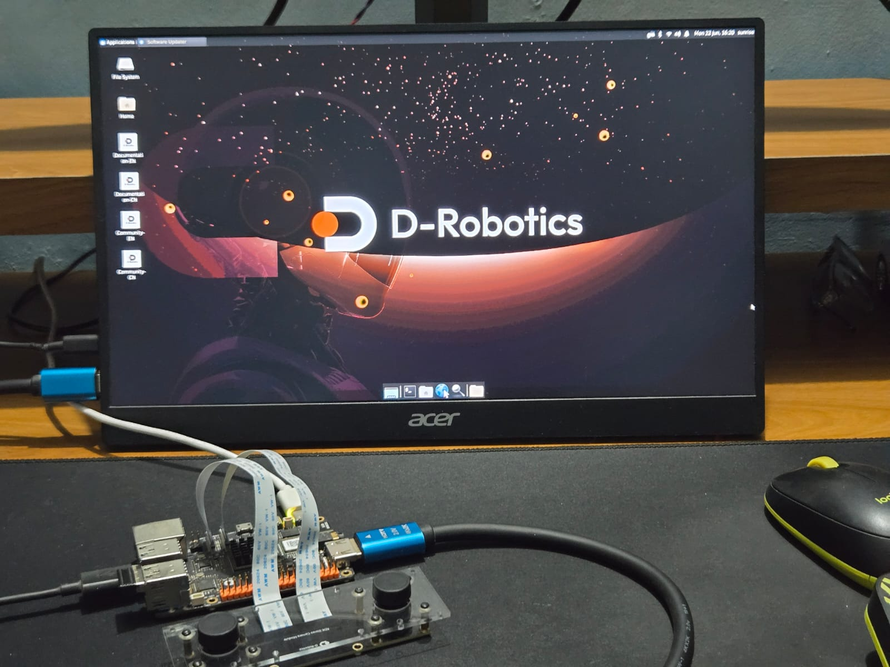
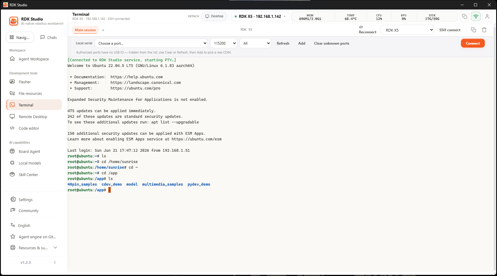
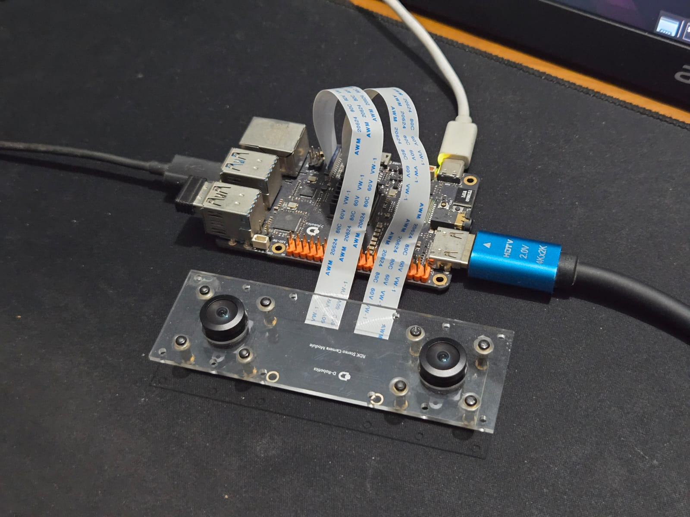
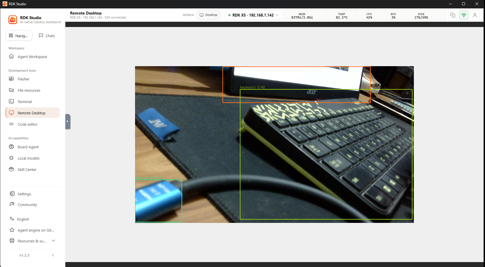

# RDK X5 Autonomous Vehicle


](https://developer.d-robotics.cc/))
[](https://www.espressif.com/)


# RDK X5 Autonomous Vehicle

An AI-powered 1/10 scale autonomous vehicle built using the **D-Robotics RDK X5**, demonstrating real-time road tracking, object detection, behavior planning, and autonomous driving using ROS 2.

This project is being developed as part of the **D-Robotics Robotics Dream Keeper Challenge 2026**.

## Features

- AI-powered autonomous driving
- D-Robotics Racing Track Detection (ResNet18)
- YOLOv11 object detection
- ROS 2 modular architecture
- UART communication with ESP32-C3
- Manual / Autonomous driving modes
- Autonomous lane following
- Obstacle avoidance
- Autonomous lane changing

## AI Models

| Model | Purpose |
|---------|----------|
| D-Robotics Racing Track Detection (ResNet18) | Road Tracking |
| YOLOv11 | Vehicle & Obstacle Detection |

## Project Status

| Stage | Status |
|-------|--------|
| Stage 1 – Ignite Challenge | ✅ Completed |
| Stage 2 – Build Challenge | ✅ Completed |
| Stage 3 – Launch Challenge | 🚧 In Progress |

---

## Hardware

| Component          | Description                          |
| ------------------ | ------------------------------------ |
| Main Controller    | D-Robotics RDK X5                    |
| Camera             | D-Robotics Stereo Vision MIPI Camera |
| Storage            | 16GB+ microSD Card                   |
| Network            | Wi-Fi / Ethernet                     |
| Vehicle Controller | ESP32 (Planned)                      |
| Chassis            | RC Vehicle Platform (Planned)        |

---

## Software

| Software     | Purpose                 |
| ------------ | ----------------------- |
| RDK Studio   | Development Environment |
| Ubuntu 22.04 | Operating System        |
| Python 3     | Application Development |
| OpenCV       | Computer Vision         |
| YOLO Models  | AI Object Detection     |

---

# Stage 1 - Ignite Challenge

## Install RDK Studio

Download RDK Studio:

https://developer.d-robotics.cc/en/rdkstudio

RDK Studio provides:

* Terminal Access
* Remote Desktop
* Remote File Manager
* Code Editor
* Device Manager
* System Flasher
* MOSS AI Assistant

The built-in MOSS AI assistant can help execute commands, generate scripts, and assist with debugging.

---

# Flashing RDK X5

Official Documentation:

https://d-robotics.github.io/rdk_studio_doc/en/quick-start/flash-system

You can also refer to my RDK X5 review video:

https://youtu.be/mKs4PMVIh3Y

## Flashing Steps

1. Insert a microSD card (16GB minimum).
2. Open **RDK Studio**.
3. Navigate to **Flasher**.
4. Select:

```text
Device: RDK X5
```

5. Select:

```text
RDKOS 3.5.0
Ubuntu 22.04 Desktop GUI
```

6. Select the microSD card.
7. Click **Start Flash**.
8. Wait for download and flashing to complete.
9. Insert the microSD card into the RDK X5.
10. Connect HDMI, keyboard, mouse and power.

---

# Connecting to the Board

Official Documentation:

https://d-robotics.github.io/rdk_studio_doc/en/quick-start/connect-device/ssh

## Wi-Fi Method

If a display is connected:

1. Open Wi-Fi settings.
2. Connect to your network.
3. Note the assigned IP address.

## Ethernet Method

If no display is available:

1. Connect Ethernet to the router.
2. Wait for the board to boot.
3. Open your router management page.
4. Locate the device.

The board may appear as:

```text
ubuntu
```

or

```text
sunrise
```

## SSH Login

```bash
ssh sunrise@<RDK_X5_IP_ADDRESS>
```

Example:

```bash
ssh sunrise@192.168.1.100
```

---

# RDK Studio Features Tested

| Feature             | Status |
| ------------------- | ------ |
| Device Connection   | ✅      |
| SSH Terminal        | ✅      |
| Remote Desktop      | ✅      |
| Remote File Manager | ✅      |
| Code Editor         | ✅      |
| Device Management   | ✅      |

---

# Sensor Verification

## Stereo Vision MIPI Camera

The D-Robotics image includes several preloaded AI examples and precompiled models.

Example location:

```bash
/app
```

### Install Dependencies

```bash
cd /app/pydev_demo
pip install -r ../requirements.txt
```

### Run YOLOv5 MIPI Camera Demo

```bash
cd /app/pydev_demo/08_mipi_camera_sample

sudo python3 01_mipi_camera_yolov5s.py
```

---

# Viewing Results

## Local Display

Run the demo directly from:

* HDMI Display
* RDK Studio Remote Desktop

## SSH Session

If running through SSH:

```bash
export DISPLAY=:0
```

A desktop session must already be active on the board.

For most users, RDK Studio Remote Desktop is the easiest method for viewing graphical AI outputs.

---

# AI Verification

The following AI applications were successfully tested:

| Demo               | Status |
| ------------------ | ------ |
| YOLOv5 USB Camera  | ✅      |
| YOLOv5 MIPI Camera | ✅      |

---

# Deliverables

## Screenshot A

RDK Studio flashing process and SSH connection.



## Screenshot B

Stereo Vision MIPI Camera operational.
   

## Screenshot C

YOLO object detection running on the RDK X5.
 

---

# Previous RDK X5 Projects

## RDK X5 Review

https://youtu.be/mKs4PMVIh3Y

## Doctor Doom AI Assistant

https://youtu.be/8uTyAJ5kaSc

## AI Valentine's Robot

https://youtu.be/LycdAzMbdvA

---

## Project Documentation

- 📄 [Stage 2 Proposal](PROPOSAL.md)

- 🗺️ [Development Roadmap](ROADMAP.md)

RDK X5 Autonomous Vehicle

Robotics Dream Keeper Challenge 2026

# Author

**Vishal Sharma**

YouTube Channel [Pro Know ]: https://www.youtube.com/@proknow
