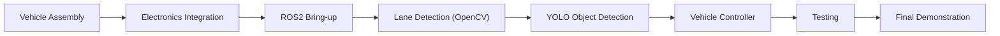

# RDK X5 Autonomous Vehicle
## Development Roadmap

**Version:** 1.1

---

# Project Objective

Develop a 1/10 scale autonomous vehicle using the D-Robotics RDK X5 capable of:

- Lane detection using an OpenCV-based vision pipeline**
- Vehicle & obstacle detection using **YOLOv11**
- Autonomous lane following
- Autonomous lane changing
- ROS2-based software architecture
- Manual RC override

---

# Milestones

| ID | Milestone | Exit Criteria |
|----|-----------|---------------|
| M0 | Stage 1 | RDK Studio, Stereo Camera, OpenCV demo, YOLO demo and UART verified |
| M1 | Stage 2 | Proposal, Architecture and Roadmap completed |
| M2 | Vehicle Assembly | Complete mechanical platform |
| M3 | ROS2 Bring-up | All ROS2 nodes communicate correctly |
| M4 | OpenCV | Reliable lane detection on the custom miniature track |
| M5 | YOLOv11 Integration | Vehicles and obstacles detected in real time |
| M6 | Vision Pipeline Integration | OpenCV lane detection and YOLO object detection operate together |
| M7 | Behavior Planner | Lane following and lane change implemented |
| M8 | Autonomous Vehicle | Complete autonomous lap |
| M9 | Final Release | Video, documentation and GitHub release |

---

# Acceptance Criteria

| ID | Goal |
|----|------|
| G1 | Camera ≥30 FPS |
| G2 | Reliable real-time lane detection ≥20 FPS |
| G3 | YOLOv11 ≥15 FPS |
| G4 | Simultaneous lane detection and object detection |
| G5 | Autonomous road tracking |
| G6 | Obstacle avoidance |
| G7 | Manual override available |

---

# Stage 1 Assets Reused

- RDK Studio setup
- Ubuntu image
- Stereo Vision MIPI Camera
- YOLO Demo
- UART Communication
- GitHub repository

---

# Planned Releases

| Version | Description |
|---------|-------------|
| v0.1 | Stage 1 Complete |
| v0.2 | Vehicle Platform |
| v0.3 | ROS2 Bring-up |
| v0.4 | OpenCV Lane Detection |
| v0.5 | YOLOv11 Integration |
| v0.6 | Vision Pipeline Integration |
| v0.7 | Behavior Planner |
| v0.8 | Autonomous Driving |
| v1.0 | Final Challenge Submission |

# Final Outcome

✅ Autonomous lane following implemented using OpenCV.
✅ YOLO-based object detection integrated.
✅ ROS 2 modular software architecture completed.
✅ ESP32-C3 vehicle controller integrated.
✅ Manual, Assisted, and Autonomous driving modes implemented.
