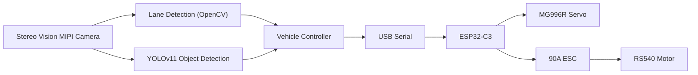

# RDK X5 Autonomous Vehicle
## Stage 3 – Launch Challenge
### Robotics Dream Keeper Challenge 2026

**Author:** Vishal Sharma (Pro Know)  
**Repository:** https://github.com/proknowdiy/RDK-X5-Autonomous-Vehicle
**Demo Video:** https://youtu.be/OJs40JOCPPU

---

# Project Overview

The **RDK X5 Autonomous Vehicle** is a 1/10 scale autonomous vehicle developed using the **D-Robotics RDK X5** and **ROS 2**.

The project demonstrates an end-to-end autonomous driving pipeline combining **OpenCV-based lane detection**, **YOLOv11 object detection**, and an **ESP32-C3 vehicle controller** for real-time steering and throttle control.

Unlike a traditional line-following robot, the vehicle operates on a realistic miniature road and supports **manual** and **autonomous** driving modes using a RadioLink RC transmitter.

---

# Final Features

- OpenCV-based lane detection
- YOLOv11 object detection
- Stop sign recognition
- Obstacle detection with safe vehicle stop
- ROS 2 modular software architecture
- UART communication with ESP32-C3
- Manual / Autonomous driving modes
- Real-time vehicle control

---

# Final System Architecture



---

# Hardware

| Component | Description |
|-----------|-------------|
| Main Controller | D-Robotics RDK X5 |
| Camera | Stereo Vision MIPI Camera |
| Vehicle Controller | DFRobot Beetle ESP32-C3 |
| Steering Servo | MG996R |
| ESC | RadioLink 90A Brushed ESC |
| Motor | RS540 Brushed Motor |
| Radio System | RadioLink RC6GS |
| Battery | 3S LiPo |

---

# Software

- Ubuntu 22.04
- ROS 2 Humble
- OpenCV
- YOLOv11
- Python
- C++

---

# ROS2 Packages

```text
autonomous_vehicle
lane_detection
vehicle_controller
```

---

# Final Implementation

The RDK X5 processes images from the Stereo Vision MIPI Camera using two parallel perception pipelines:

- **Lane Detection** using OpenCV for steering estimation.
- **YOLOv11** for detecting vehicles, stop signs and other obstacles.

The Vehicle Controller combines both inputs and sends steering and throttle commands over USB serial to the ESP32-C3.

The ESP32-C3 controls the steering servo and ESC while also handling Manual and Autonomous mode switching through the RadioLink receiver.

---

# Performance

The project was tested on the RDK X5 using real hardware.

### Vehicle Controller Runtime

<p align="center">
  
</p>


---

### RDK X5 Performance Monitoring (dtop)

<p align="center">
  
</p>

---

### Object Detection

<p align="center">
  
</p>

---

### Lane Detection

<p align="center">
  
</p>

---

# Results

✅ Autonomous lane following

✅ YOLOv11 object detection

✅ Stop sign recognition

✅ Obstacle detection with automatic stopping

✅ Manual / Autonomous mode switching

✅ ROS 2 modular architecture

✅ USB serial communication between RDK X5 and ESP32-C3

---

# Lessons Learned

- OpenCV provided a reliable lane detection solution for the custom miniature road.
- Classical computer vision reduced computational load while allowing the RDK X5 BPU to focus on YOLO object detection.
- Separating high-level decision making (RDK X5) from low-level vehicle control (ESP32-C3) resulted in a clean and modular architecture.
- ROS 2 simplified communication between different software modules.

---

# Future Improvements

- Dynamic obstacle avoidance
- Autonomous lane changing
- Traffic light recognition
- Stereo depth estimation
- SLAM and autonomous navigation

---

# Challenge Deliverables

| Deliverable | Status |
|-------------|--------|
| Stage 1 – Ignite | ✅ Completed |
| Stage 2 – Build | ✅ Completed |
| Stage 3 – Launch | ✅ Completed |
| GitHub Repository | ✅ |
| Source Code | ✅ |
| Documentation | ✅ |
| Final Demonstration Video | ✅ *(Add Link)* |

---

# Project Gallery

### Autonomous Vehicle

<p align="center">
  
</p>

---

### Lane Detection & Object Detection

<p align="center">
  
</p>

---

### Stop Sign Detection

<p align="center">
  
</p>

---

# Conclusion

The RDK X5 Autonomous Vehicle demonstrates how classical computer vision and AI can be combined to build a compact autonomous driving platform. By integrating OpenCV-based lane detection, YOLOv11 object detection, ROS 2, and an ESP32-C3 vehicle controller, the project successfully delivers a modular and extensible autonomous vehicle suitable for education, research, and rapid prototyping.
